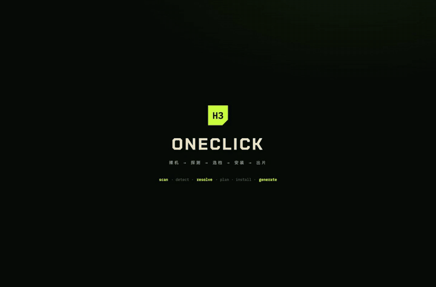

<div align="center">

# H3 OneClick

**Bare metal → detect → pick profile → install → video out. One binary turns any GPU box into an H3 video-gen node.**


<a href="docs/media/h3-oneclick-demo.mp4">
  
</a>

*40s real run on a 2× RTX 5090D box: scan → `turbo-4-768` picked → assets reused/downloaded → `READY_FOR_BASELINE` → ComfyUI up → the clip at the end is the actual generated mp4, uncut. Click for full video with audio.*

</div>

## What it does

- **Hardware scan** — NVIDIA GPU / Apple Silicon, VRAM, RAM, disk, CUDA, ffmpeg
- **ComfyUI discovery** — finds existing installs, detects venv / adapter / model inventory, reuses instead of re-downloading 25GB
- **Profile gating** — picks a stack by platform + free VRAM; profiles that don't fit are blocked with reasons, not silently attempted
- **Mirror fallback** — HF timeouts auto-switch to `hf-mirror.com` / jsDelivr same-file mirrors; never silently swaps to a different format
- **Real install** — ComfyUI venv, DiT/TE/VAE weights, turbo LoRA, workflow, adapter — all on disk, SHA-checked, receipt per step
- **End-to-end generation** — official subgraph workflow auto-converted to API prompt, submitted to `/prompt`, produces a real mp4 (h264 + AAC)

## Two front ends, one engine

| Entry | What |
|---|---|
| Desktop GUI | Wails native window (`gui/`), 4-step control deck |
| CLI + Web UI | Single binary serving `:8765`, same flow in a browser |

## Quick start

Download a binary from [Releases](https://github.com/yoligehude14753/h3-oneclick/releases) (unsigned builds — macOS may need `xattr -d com.apple.quarantine`), then:

```sh
./h3-oneclick   # → http://127.0.0.1:8765
```

Or from source:

```sh
go run ./cmd/h3-oneclick                    # CLI + Web UI
cd gui && wails build                       # desktop app → gui/build/bin/h3-oneclick.app
```

Single-binary builds:

```sh
GOOS=windows GOARCH=amd64 go build -o dist/h3-oneclick-windows-amd64.exe ./cmd/h3-oneclick
GOOS=linux   GOARCH=amd64 go build -o dist/h3-oneclick-linux-amd64   ./cmd/h3-oneclick
GOOS=darwin  GOARCH=arm64 go build -o dist/h3-oneclick-macos-arm64   ./cmd/h3-oneclick
```

## H3 profiles

| Profile | Tier | Stack |
|---|---|---|
| `native-20` | native 20-step | `cuda-native20-bf16` |
| `turbo-8` | turbo 8-step | `cuda-turbo8-bf16` |
| `turbo-4-768` | turbo 4-step @768w | `cuda-turbo4-768-bf16` (auto-picked on dual 32GB) |

## API

`/api/scan` · `/api/best-config` · `/api/plan` · `/api/sources/probe` · `/api/install` · `/api/template/open` · `/api/health`

All JSON, errors carry `error`/`message`. `/api/scan` accepts explicit `paths`/`ports` for non-standard ComfyUI locations.

## Verified on

| Machine | Hardware | Result |
|---|---|---|
| daheng (Beijing) | 2× RTX 5090 D | Full pipeline, `864×480 / 5.17s / h264+AAC` |
| heyi (Beijing) | RTX 5090 D + RTX 5090, 1.1TB RAM | GUI flow + generation; mirror fallback engaged when HF unreachable |
| MacBook M4 | Apple Silicon 24GB | Detect + recommend `macos-metal-h3c` (external profile, advisory only) |

## Limits

- Weights are not bundled; the manifest records exact paths + primary/mirror sources.
- Default instance scan covers `~/ComfyUI`, `~/AI/ComfyUI`, `./ComfyUI` only — elsewhere needs explicit `paths` (BUG-002).
- Windows CUDA path untested on real hardware.
- Architecture ledger: [docs/ARCHITECTURE_FEATURE_LEDGER.md](docs/ARCHITECTURE_FEATURE_LEDGER.md)
