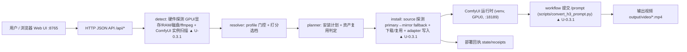

# h3-oneclick 架构、功能与版本记录

> 更新：2026-09-18。每次产品改动都必须同步到受影响的架构图节点、功能、Bug 与修复、版本记录。

## 一、架构图

| 更新标记 | 版本 / 日期 | 已同步到图中节点 | 本次架构变更 |
|---|---|---|---|
| ▲ U-0.3.1 | 2026-09-18 | detect、install、Submit | h3-workflow-t2v 增加 jsDelivr same_file_mirror；补 UI→API workflow 转换脚本打通 /prompt 提交链路 |

## 二、功能地图

| 功能 ID | 功能点 | 现状 | 开发完成 | 已整合 | 未开发 | 发生的 Bug / 影响 | 功能实现 | 最近更新标记 |
|---|---|---|---|---:|---:|---:|---|---|---|
| F-01 | 硬件与环境探测（GPU 型号/显存/CUDA/MPS/RAM/磁盘/ffmpeg） | 可用 | 是 | 是 | 否 | — | `internal/detect` nvidia-smi + MPS 探测 | |
| F-02 | 现有 ComfyUI 实例探测与复用 | 可用（有限制） | 是 | 是 | 否 | BUG-002：默认扫描仅覆盖 ~/ComfyUI、~/AI/ComfyUI 与 CWD 下 ./ComfyUI，其他位置实例需 scan 时显式传 paths | `internal/detect` inspectInstance + `/api/scan` paths/ports 参数 | ▲ U-0.3.1 |
| F-03 | profile 解析与自动选档 | 可用 | 是 | 是 | 否 | — | `internal/resolver` 门控 + 打分 | |
| F-04 | 安装计划生成（资产清单/目标路径/reuse 判定/阻塞原因） | 可用 | 是 | 是 | 否 | — | `internal/server` `/api/plan` | |
| F-05 | 资产下载与多源 fallback | 可用 | 是 | 是 | 否 | BUG-001：h3-workflow-t2v 仅 GitHub raw 单源，网络不可达时整单 SOURCE_BLOCKED（已修复） | `internal/source` primary→same_file_mirror 探测下载 | ▲ U-0.3.1 |
| F-06 | H3OneClickAdapter 与 workflow 写入 | 可用 | 是 | 是 | 否 | — | `internal/install` adapter + workflows/ 落盘 | |
| F-07 | 部署回执 | 可用 | 是 | 是 | 否 | — | `state/receipts/job-*.json` | |
| F-08 | 端到端真实生成验收 | 已验证（daheng） | 是 | 是 | 否 | — | `scripts/convert_h3_prompt.py` 展开 subgraph → `/prompt` → mp4 产出 | ▲ U-0.3.1 |
| F-09 | macOS external profile（h3.c 指引） | 仅探测+建议 | 是 | 是 | 否 | — | `macos-metal-h3c` external profile | |
| F-10 | 生成任务 API / 远程访问 / LLM runtime | 未开发 | 否 | 否 | 是 | — | — | |

## 三、Bug 与修复

| Bug ID | 关联功能 | 状态 | 现象 | 修复实现 | 验收结果 | 下一步 |
|---|---|---|---|---|---|---|
| BUG-001 | F-05 | 已修复 | daheng 真实 install 时 `h3-workflow-t2v` 的 GitHub raw 主源 CONNECT_TIMEOUT（30s），无 fallback，install 终态 SOURCE_BLOCKED | `internal/manifest/default.json` 为该资产增加 jsDelivr `same_file_mirror`（`cdn.jsdelivr.net/gh/Comfy-Org/workflow_templates@main/...`） | 主源 30s 超时后镜像 784ms 命中，`workflows/video_minimax_h3_t2v.json` 67,891B 落盘，install 终态 READY_FOR_BASELINE | 观察其他 GitHub 源资产是否需要同类镜像 |
| BUG-002 | F-02 | 已知未修复 | 服务从非实例父目录启动时，`./ComfyUI` 相对扫描漏探 `/home/ai/h3-oneclick/ComfyUI`，plan 误选另一实例并全量标记 reuse=false | 未改代码；`/api/scan` 显式传 `paths`/`ports` 可规避 | 显式传参后正确识别 inst-cdfdf8529226，5 个模型资产全部 reuse=true | 考虑把常用实例路径持久化或扩大默认扫描面 |

## 四、版本记录

| 版本 / 日期 | 本次迭代 | 修复或实现方式 | 结果 / 遗留 | 架构图标记 |
|---|---|---|---|---|
| v0.3.0 / 2026-08-24 | 初始版本：探测 + 解析 + 安装计划 + dry-run + Web UI | Go 单文件服务 + 内嵌 manifest + 内置页面 | macOS 链路验证到 plan/dry-run；Windows/Linux CUDA 未实测 | — |
| v0.3.1 / 2026-09-18 | workflow 源 fallback 修复 + daheng 端到端真实生成验收 | jsDelivr same_file_mirror；`scripts/convert_h3_prompt.py` 提交官方 subgraph workflow | daheng 双 RTX 5090D 上 turbo-4-768 profile 真实出片：864×480、5.17s、含 AAC 音轨的 mp4；BUG-002 为例扫描限制遗留 | ▲ U-0.3.1 |
